# API Mobile (phiên bản 1.0)

**[Link Api Develop](https://appdev.ezbuy.jp/swagger)**: *https://appdev.ezbuy.jp/swagger*

**[Link Api Product](https://app.janbox.com/swagger)**: *https://app.ezbuy.jp/swagger*

### Tổng quan và cấu trúc code dự án

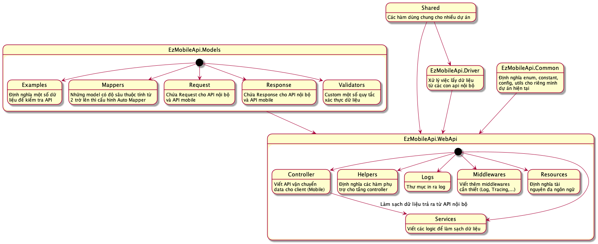

* Một số điểm lưu ý:
    * Phân trang cho Amazon hay một số sản phẩm từ website không có pageSize ổn định: Xử lý theo luồng
      logic ([xem ví dụ chi tiết tại đây](https://git.ichiba.vn/ezbuyjp/ez-mobile-api/-/blob/develop/EzMobileApi.Driver/Helpers/PagingProductAmazonHelper.cs))
      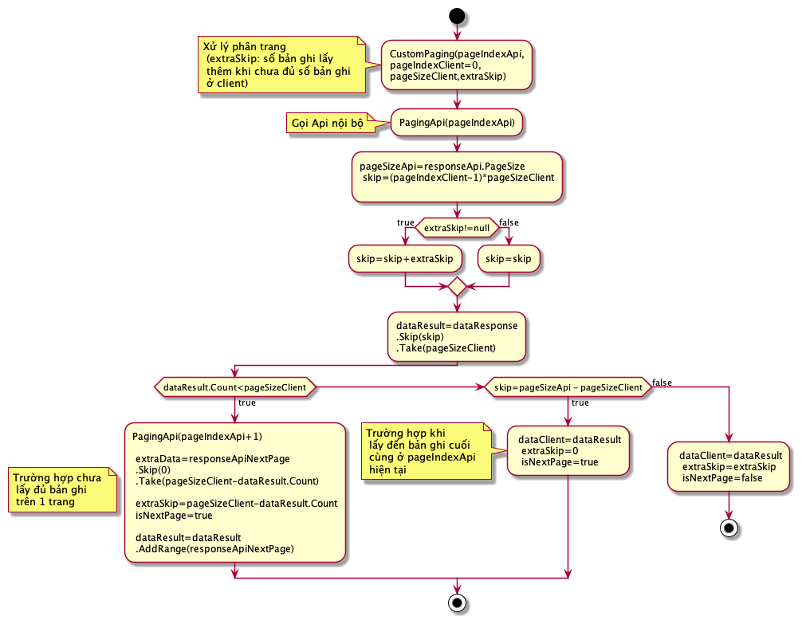

    * Cấu hình file appsettings.json. Các file **appsettings.{ENV}.json** sẽ kế thừa các thuộc tính của file
      appsetting.json cho nên chỉ đặt những thuộc tính mà môi trường đó cần phải cấu hình (tránh trường hợp sao chép cả
      file appsetting.json) ([xem ví dụ chi tiết tại đây](https://git.ichiba.vn/ezbuyjp/ez-mobile-api/-/blob/develop/EzMobileApi.WebApi/appsettings.json))

      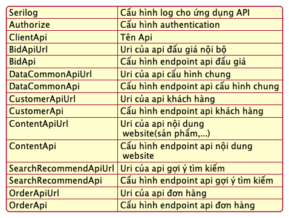

### Chi tiết nghiệp vụ

<details>
<summary>Giỏ hàng</summary>

### Luồng quản lý giỏ hàng: :heavy_check_mark:

<details>
<summary>Mô tả chi tiết</summary>

* Gọi api [Buy Now](https://appdev.ezbuy.jp/swagger/index.html#/Cart/post_mobile_api_cart_buynow) để thực hiện chức năng
  mua ngay ngoại trừ *(yahoo-auction)*.
* Gọi api [Count All Cart](https://appdev.ezbuy.jp/swagger/index.html#/Cart/get_mobile_api_cart_countallcart) để lấy số
  lượng sản phẩm có trong giỏ hàng.
* Gọi api [Add Cart](https://appdev.ezbuy.jp/swagger/index.html#/Cart/post_mobile_api_cart_addcart) để thêm sản phẩm vào
  giỏ hàng.
* Gọi api [Get Current Cart](https://appdev.ezbuy.jp/swagger/index.html#/Cart/get_mobile_api_cart_getcurrentcart) để lấy
  các sản phẩm mà người dùng đã thêm vào giỏ hàng
* Gọi api [Remove Cart](https://appdev.ezbuy.jp/swagger/index.html#/Cart/delete_mobile_api_cart_removecart)  để xoá 1
  sản phẩm ra khỏi giỏ hàng.
* Gọi
  api [Remove Multiple Cart](https://appdev.ezbuy.jp/swagger/index.html#/Cart/delete_mobile_api_cart_removemultiplecart)
  để xoá tất cả sản phẩm của người bán ra khỏi giỏ hàng.
* Gọi api [Merge Cart](https://appdev.ezbuy.jp/swagger/index.html#/Cart/post_mobile_api_cart_mergecart) để chuyển cart
  của người dùng ẩn danh vào cart của người dùng sau khi đăng ký sau khi đăng nhập thành công.

</details>
</details>

---

<details>
<summary>Thanh toán đơn hàng</summary>

### Luồng thanh toán đơn hàng: :heavy_check_mark:

<details>
<summary>Mô tả chi tiết</summary>

* Đối với thanh toán GMO và Paypal thì khách hàng phải thanh toán cho từng đơn 1 còn đối với khách hàng chọn ví ezpoint
  thì sẽ thanh toán cho tất cả đơn hàng.
* Gọi api [Create Order](https://appdev.ezbuy.jp/swagger/index.html#/Order/post_mobile_api_order_createorder)
  để tạo đơn hàng sau đó api trả ra danh sách orderId (đối với khách hàng thanh toán quan paypal hoặc GMO sẽ trả ra 1
  phần tử có trong danh sách đó).

#### Thanh toán với GMO: :heavy_check_mark:

<details>
<summary>Mô tả chi tiết</summary>

* Sau khi nhận được *orderId* và *isAllowPayment=true* từ API Create Order sẽ gọi sang
  api [Order Payment](https://appdev.ezbuy.jp/swagger/index.html#/Payment/post_mobile_api_payment_orderpayment).
* Kết quả trả về từ api Order Payment có *redirectUrl* và *status* của api (**Lưu ý:** không phải status của data trả
  ra) tiến hành chuyển sang trang **redirectUrl**.
* Định nghĩa successUrl và cancelUrl ở dưới client để trở lại trang lỗi hoặc thành công sau khi người dùng thanh toán.
* Sau khi hoàn thành thanh toán đơn thứ nhất thì trở lại trang thanh toán đối với khách hàng vẫn còn sản phẩm ở màn
  checkout tiếp đó gọi
  api [Get Information Checkout Order Info](https://appdev.ezbuy.jp/swagger/index.html#/Order/post_mobile_api_order_getinformationcheckoutorderinfo)
  để kiểm tra xem các đơn hàng đã được thành toán thành công hay chưa (**Lưu ý:** Có nên lưu lại *orderId* ở state hay
  không?).
* Sau đó gọi
  đến [Get Order Confirm](https://appdev.ezbuy.jp/swagger/index.html#/Cart/get_mobile_api_cart_getorderconfirm) để lấy
  những đơn hàng trong giỏ hàng mà khách hàng đã chọn ở lần checkout (**Lưu ý:** Nên lưu lại productIds vào state hay
  không? *"Trên web đang để productId ở successUrl"*).
* Thanh toán đến khi nào hết đơn hàng ở màn checkout.

</details>

#### Thanh toán với Paypal: :heavy_check_mark:

```
Tương tự như với thành toán GMO
```

#### Thanh toán với ví Ezbuy: :heavy_check_mark:

<details>
<summary>Mô tả chi tiết</summary>

* Sau khi lấy được danh sách OrderIds gọi
  api [Order Payment From Wallet](https://appdev.ezbuy.jp/swagger/index.html#/Payment/post_mobile_api_payment_orderpaymentfromwallet)
  để thanh toán từ ví ezpoint

</details>

```
Đối với các trường hợp bị lỗi 500 400 từ api trả ra thông báo cho khách hàng không thanh toán thành công
```

</details>

### Luồng checkout đơn hàng: :heavy_check_mark:

<details>
<summary>Mô tả chi tiết</summary>

* Gọi api [Get Order Confirm](https://appdev.ezbuy.jp/swagger/index.html#/Cart/get_mobile_api_cart_getorderconfirm) lấy
  ra những sản phầm trong giỏ hàng mà khách hàng chọn checkout.
* Gọi
  api [Get Member Payment Information](https://appdev.ezbuy.jp/swagger/index.html#/Payment/get_mobile_api_payment_getmemberpaymentinformation)
  lấy thông tin thẻ của khách hàng đối với các phương thức thành toán GMO và Paypal.
* Gọi
  api [Check Exist Card Gmo](https://appdev.ezbuy.jp/swagger/index.html#/Payment/get_mobile_api_payment_checkexistcardgmo)
  để check xem người dùng đã thêm thẻ hay chưa? Nếu có thì hiển thị nút thêm thẻ để người dùng tiền hàng nhập thẻ thành
  toán GMO (đối với GMO)
* Gọi
  api [Get Link Gmo Management](https://appdev.ezbuy.jp/swagger/index.html#/Payment/get_mobile_api_payment_getlinkgmomanagement)
  để lấy link Url sang bên trang thêm thẻ của GMO, khi người dùng thêm thành xong vì không có nút quay về nên có thể tìm
  cách nào giúp người dùng quay về hoặc bắt người dùng tắt webview để tiền hàng thanh toán đơn hàng. Khi quay lại trang
  check out kiểm tra lại xem người dùng đã thêm thẻ thành công hay chưa bằng
  api [Check Exist Card Gmo](https://appdev.ezbuy.jp/swagger/index.html#/Payment/get_mobile_api_payment_checkexistcardgmo)
  .
* Gọi
  api [Get Customer Wallet](https://appdev.ezbuy.jp/swagger/index.html#/Customer/get_mobile_api_customer_getcustomerwallet)
  lây thông tin ví của người dùng hiện tại đang có 2 loại ví là "*primary* và *promotion*" đối với phiên bản 1.0 chưa
  dùng đến ví *promotion* nên chỉ hiển thị ví primary.
* Gọi
  api [Get All Order Service](https://appdev.ezbuy.jp/swagger/index.html#/Order/get_mobile_api_order_getallorderservice)
  lấy toàn bộ dịch vụ của ezBuy cho đơn hàng.
* Gọi
  api [Get Customer Address And Shipping Method](https://appdev.ezbuy.jp/swagger/index.html#/Cart/get_mobile_api_cart_getcustomeraddressandshippingmethod)
  để lấy thông tin địa chỉ khách hàng kèm với các phương thức vận chuyển kèm theo nếu có ở country mà người dùng đã set
  địa chỉ mặc định. Kiểm tra trường hợp người dùng không có địa chỉ bắt người dùng thêm địa chỉ bằng
  api [Add Customer Address](https://appdev.ezbuy.jp/swagger/index.html#/Customer/post_mobile_api_customer_addcustomeraddress)
  .
* Nếu người dùng thay đổi địa chỉ khác gọi
  api [Get Forwarder Method By Country Code](https://appdev.ezbuy.jp/swagger/index.html#/CommonData/get_mobile_api_commondata_getforwardermethodbycountrycode)
  để lấy các phương thức vận chuyển khác theo địa chỉ mà người dùng đã chọn.
* Ở màn hình danh sach địa chỉ gọi
  api [Get List Address By AccountId](https://appdev.ezbuy.jp/swagger/index.html#/Customer/get_mobile_api_customer_getlistbyaccountid)
  để lấy danh sách địa chỉ của khách hàng.
    * Gọi
      api [Set Default Customer Address](https://appdev.ezbuy.jp/swagger/index.html#/Customer/post_mobile_api_customer_setdefaultcustomeraddress)
      để đặt địa chỉ mặc định cho khách hàng.

</details>

</details>

---

<details>
<summary>Quản lý cá thông tin khách hàng</summary>

### Luồng quản lý đơn hàng: :heavy_check_mark:

<details>
<summary>Mô tả chi tiết</summary>

* Gọi api [Filter Order](https://appdev.ezbuy.jp/swagger/index.html#/Order/get_mobile_api_order_filterorder) tải danh
  sách cũng như tìm kiếm, phân trang các đơn hàng của khách hàng.
    * *Lưu ý:* Đối với các đơn hàng có **status=0 hoặc status=1** hiện nút thanh toán ngay (Bản vẽ chưa có thì báo lại
      với bên design).
    * Đối với các đơn hàng có **status=0 hoặc status=1** ở nút khác hiện thêm nút *huỷ đơn* cho khách hàng ở modal
      bottom *more action*.
* Gọi
  api [Get Order Detail](https://appdev.ezbuy.jp/swagger/index.html#/Order/get_mobile_api_order_getorderdetail__orderId_)
  để lấy chi tiết đơn hàng (*Lưu ý:* Phần tracking của đơn hàng chưa có api nên tạm thời bỏ qua chưa cần ghép api chỉ
  cần vẻ giao diện).
* Trong chi tiết đơn hàng nếu khách hàng chưa có dịch vụ chụp ảnh thì thêm modal bottom *Yêu cầu chụp ảnh*
    * Khi nhấn vào yêu cầu chụp ảnh sẽ gọi
      api [Get Order Service Request Photo](https://appdev.ezbuy.jp/swagger/index.html#/Order/get_mobile_api_order_getorderservicerequestphoto)
      để lấy thông tin về dịch vụ chụp ảnh
    * Đối với chức năng thanh toán của yêu cầu gửi ảnh sẽ gọi
      api [Order Request Photo](https://appdev.ezbuy.jp/swagger/index.html#/Order/put_mobile_api_order_orderrequestphoto)
      để thêm dịch vụ chụp ảnh đồng thời thanh toán đơn hàng khi api **Order Request Photo** trả ra *status=true*
    * Phần thanh toán xem thêm *luồng thanh toán đơn hàng*.
    * Đối với huỷ đơn hàng gọi
      api [Update Status Order](https://appdev.ezbuy.jp/swagger/index.html#/Order/put_mobile_api_order_updatestatusorder)
      để cập nhật order với *status=8*.
    * Đối với nút thanh toán đơn hàng sẽ navigate sang trang màn hình payment *(Phần này sẽ trao đổi sau)*.

</details>

### Luồng quản lý gói hàng: :x:

<details>
<summary>Mô tả chi tiết</summary>

</details>

### Luồng quản lý địa chỉ của khách hàng: :x:

<details>
<summary>Mô tả chi tiết</summary>

</details>

### Luồng quản lý sản phẩm đấu giá: :x:

<details>
<summary>Mô tả chi tiết</summary>

</details>

### Luồng quản lý yêu thích: :x:

<details>
<summary>Mô tả chi tiết</summary>

</details>

### Luồng quản lý ví Ezbuy: :x:

<details>
<summary>Mô tả chi tiết</summary>

</details>

### Luồng quản lý khiếu nại: :x:

<details>
<summary>Mô tả chi tiết</summary>

</details>

### Luồng quản lý thông báo: :x:

<details>
<summary>Mô tả chi tiết</summary>

</details>

### Luồng quản lý thẻ thanh toán: :heavy_check_mark:

<details>
<summary>Mô tả chi tiết</summary>

* Gọi api [List Card GMO](https://appdev.ezbuy.jp/swagger/index.html#/Payment/get_mobile_api_payment_listcardgmo) để lấy
  danh sách thẻ thanh toán GMO của người dùng hiện tại.
* Gọi
  api [Get Link GMO Management](https://appdev.ezbuy.jp/swagger/index.html#/Payment/get_mobile_api_payment_getlinkgmomanagement)
  để lấy link Url chuyển sang trang quản lý thẻ của GMO, tất cả các nút *thêm*, *sửa*, *xoá* ở các ô thẻ sẽ chỉ có 1
  link duy nhất nhận được từ url.

  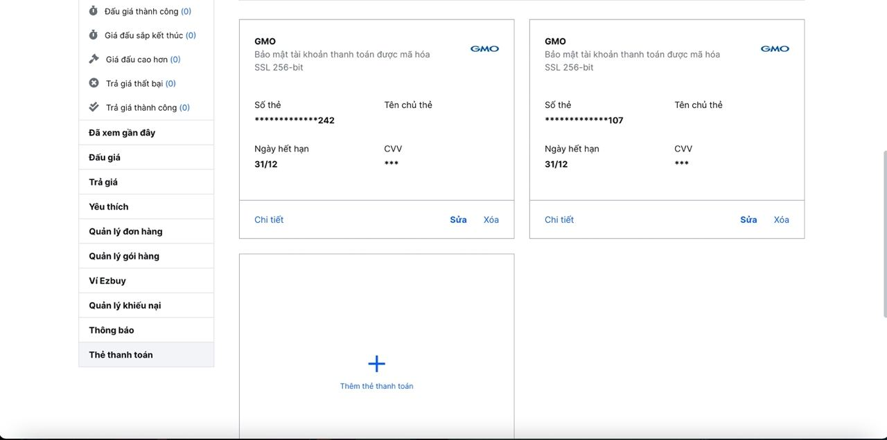

</details>

</details>

---

<details>
<summary>Đấu giá Yahoo Auction</summary>

### Luồng kiểm tra điều kiện chi tiết yahoo auction: :heavy_check_mark:

<details>
<summary>Mô tả chi tiết</summary>

* Nếu người dùng chưa đăng nhập gọi
  api [Get Product Detail](https://appdev.ezbuy.jp/swagger/index.html#/ProductSearch/get_mobile_api_productsearch_getproductdetail)
  lấy dữ liệu và hiên thị cho người dùng.
  ```
  // Chú ý sản phâm detail có 2 giá là giá hiện tại và giá mua ngay.
  // Giá hiện tại
  if (product.TaxRate > 0 && product.PriceInclude > 0)
  {
      Giá bao gồm thuế (quy đổi ra tiền tệ)= product.PriceInclude * exchangeRate
  }
  //Giá mua ngay
  if (product.BidOrBuy > 0)
  {
     if (product.BidOrBuyInclude > 0)
    {
      Giá bao gồm thuế (quy đổi ra tiền tệ)= product.BidOrBuyInclude * exchangeRate
    }

    if(sCountdown > 0 && product.Lock == false){
       @if (product.BidOrBuy > 0)
       {
         Hiển thị nút mua ngay
       }
    }
    else
    {
      Hiển thị nút mua ngay
    }
  }

  ```


* Kiểm tra một số điều kiện để viết hiển thị các nút đấu giá và săn phút chót và mua ngay:

  ```
  if(coundown>0 && product.Lock==false){
    if(product.BidOrBuy == 0 || product.Price < product.BidOrBuy){
        Hiển thị nút bid
    }

    if (product.BidOrBuy > 0)
    {
        //giá mua ngay > giá hiện tại thì vẫn có nút săn phút chót
        if (product.BidOrBuy > product.Price)
        {
            Hiển thị nút săn phút chót
        }
    }
    else
    {
       Hiển thị nút săn phút chót
    }

    if (product.BidOrBuy > 1 && (currentContext.IsAuthenticated && product.Price >= product.BidOrBuy))
    {
      Hiển thị nút trả giá và mua
    }
  }
  ```
* Cảnh báo và thể hiện thông tin đơn hàng đấu giá thắng
  ```
  if (product.Price <= 1)
  {
    Hiển thị cảnh báo cho người dùng "Sản phẩm 1 yên thường có phí vận chuyển rất cao và thời gian giao hàng kéo dài"
  }

  if(sCountdown > 0 && product.Lock)
  {
    Hiển thị cảnh báo không được đấu giá, Để được hỗ trợ xin vui lòng liên hệ Email: support@ezbuy.jp
  }
  else
  {
    if(successfulBid != null )
    {
       if (successfulBid.PaymentStatus.HasValue)
       {
            Hiển thị trạng thái đơn hàng
       }
       else
       {
            Hiển thị đấu giá thành công, Đơn hàng của bạn đang được xử lý vui lòng chờ thanh toán đơn hàng
       }
    }
  }

  ```
* Công thức để tính độ uy tín của shop
  ```
  var itemRatingAlert = seller?.Rating.Point < 300 || seller?.Rating.PercentGoodRating < 90 ? 0 : 1;
  if(itemRatingAlert==0)
  {
    Cảnh báo Shop có độ uy tín thấp
    Hiển thị Có mức độ uy tín rất thấp, nếu tham gia đấu giá bạn phải chấp nhận hoàn toàn mọi rủi ro.
  }
  else
  {
    Cảnh báo yên tâm mua sắm
    Hiển thị Shop có độ uy tín cao
  }
  ```


* Nếu người dùng đã đăng nhập thì phải kiểm tra thêm một số phần sau:
    * Gọi
      api [Get Customer Level](https://appdev.ezbuy.jp/swagger/index.html#/Customer/get_mobile_api_customer_getcustomerlevel)
      để lấy ra cấp độ khách hàng đang ở cấp độ nào và có được đầu giá hay không bằng trường *isAllowBid*.
    * Gọi
      api [Get Cash Available](https://appdev.ezbuy.jp/swagger/index.html#/Customer/get_mobile_api_customer_getcashavailable)
      để lấy ra số dư khả dụng của khách hàng.
    * Gọi
      api [Get Bid Credit Information](https://appdev.ezbuy.jp/swagger/index.html#/Bid/get_mobile_api_bid_getbidcreditinformation)
      để lấy thông tin số lượt đấu còn lại, số lượt săn phút chót còn lại,... *(Lưu ý: Nếu isMaxBid=true thì lúc đó
      người dùng đã hết lượt bid sản phẩm)*

      ```
      if(CashAvailable < product.Price)
      {
          if (isAllowBid)
          {
              Tài khoản của bạn không đủ điều kiện để sử dụng tính năng đấu giá, vui lòng nạp thêm Point vào tài khoản để sử dụng tính năng này!
          }
          else
          {
              if (bidCredit?.CreditAvailable <= 0)
              {
                  Tài khoản của bạn đã sử dụng hết số lượng đấu giá, vui lòng nạp Point để tiếp tục đấu giá hoặc liên hệ để được trợ giúp
              }
          }
      }
      Đồng thời hiển thị nút nạp tiền.
      ```

      ```
      if (isAllowBid) {
          Tài khoản của bạn chưa kích hoạt đấu giá VIP, vui lòng kích hoạt đấu giá VIP, để được hưởng ưu đãi tốt hơn.
      }
      Đồng thời hiển thị nút kích hoạt đấu giá VIP
      ```

    * Gọi
      api [Get My Highest Price](https://localhost:5001/swagger/index.html#/Bid/get_mobile_api_bid_getmyhighestprice)
      để kiểm tra người dùng có phải là người trả giá cao nhất hay không?

    ```
    if (myHighestPrice != null)
    {
          var isMyBidHighest = !isCancel && myHighestPrice.IsHighest && myHighestPrice.Price >= product.Price;
          var myBidHighestDisplay = myHighestPrice.IsYourHighestBidFail ? Đấu giá không thành công : isMyBidHighest ? Bạn là người đặt giá cao nhất : Bạn không phải là người đặt giá cao nhất;
          var color = isMyBidHighest ? xanh : đỏ
          hiển thị giá mà người dùng đã đặt cao nhất (yHighestPrice.Price)

    }

    ```

    * Nếu người dùng là người trả giá cao nhất gọi
      api [Check Shop Cancel Auction](https://localhost:5001/swagger/index.html#/Bid/post_mobile_api_bid_checkshopcancelauction)
      để kiểm tra xem có bị shop huỷ đấu giá hay không?
  ```
  if(countDown<=0){
    isCancel ? Shop huỷ bán : Đấu giá đã kết thúc
  }
  ```

    * Gọi
      api [Get Bid Last Time Registered](https://appdev.ezbuy.jp/swagger/index.html#/Bid/get_mobile_api_bid_getbidlasttimeregistered)
      lấy dữ liệu người dùng đăng ký săn phút chót

  ```
  if (BidLastTimeExisting)
  {
      if (bidLastTime.IsProcessed)
      {
          Hiển thị nút xoá săn phút chót
      }
      else
      {
          Hiển thị nút huỷ sẵn phút chót
      }
  }
  ```

  ```
  if (BidLastTimeExisting)
  {
      Hiển thị giá đã đặt săn phút chót (bidLastTime.Price)
  }
  ```

    * Gọi api [Get Successful Bid](https://appdev.ezbuy.jp/swagger/index.html#/Bid/get_mobile_api_bid_getsuccessfulbid)
      để lấy ra order mà sản phẩm hiện tại người dùng thắng hay không

  ```
  if (successfulBid != null && successfulBid.OrderId.HasValue)
  {
     Hiển thị nút thanh toán cho đơn auction đã thắng
  }
  ```
    * Goi
      api [Get YaBargain Product](https://appdev.ezbuy.jp/swagger/index.html#/Bid/get_mobile_api_bid_getyabargainproduct)
      lấy dữ liệu mà người dùng đã trả giá
  ```
  if(yaBargainCurrent!=null)
  {
    Giá bạn đã trả cho sản phẩm này
    Hiển thị giá mà người dùng đã trả giá (yaBargainCurrent.BargainPrice)
  }
  ```
    * Điều kiện để hiển thị nhận thông báo săn phút chót,
      gọi [Check Subscribe Product Last Time Minutes Quote](https://appdev.ezbuy.jp/swagger/index.html#/Bid/post_mobile_api_bid_checksubscribeproductlastminutequote)
      để check xem người dùng có đang nhận thông báo săn phút chót hay không?
  ```
  if (currentContext.IsAuthenticated && product.BidOrBuy == 0 && sCountdown > 1200)
  {
    Nút nhận thông báo săn phút chót
  }
  ```

</details>

### Luồng nhận thông báo săn phút chót: :heavy_check_mark:

<details>
<summary>Mô tả chi tiết</summary>

* Gọi
  api [Subscribe Product Last Time Minutes Quote](https://appdev.ezbuy.jp/swagger/index.html#/Bid/post_mobile_api_bid_subscribeproductlastminutequote)
  để đăng ký nhận thông báo phút chót.
* Gọi
  api [Unsubscribe Product Last Time Minutes Quote](https://appdev.ezbuy.jp/swagger/index.html#/Bid/post_mobile_api_bid_unsubscribeproductlastminutequote)
  để huỷ đăng ký nhận thông báo phút chót

</details>

### Luồng đặt giá săn phút chót: :heavy_check_mark:

<details>
<summary>Mô tả chi tiết</summary>

* Gọi
  api [Bid Last Time Register](https://appdev.ezbuy.jp/swagger/index.html#/Bid/post_mobile_api_bid_bidlasttimeregister)
  để thực hiện chức năng săn phút chót sau khi săn phút chót thành công sẽ hiện thị như ảnh
  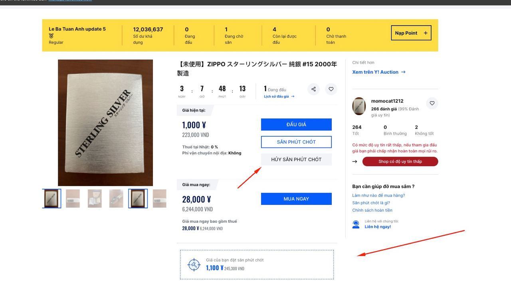

* Gọi api [Bid Last Time Cancel](https://appdev.ezbuy.jp/swagger/index.html#/Bid/post_mobile_api_bid_bidlasttimecancel)
  để huỷ tính năng săn phút chót

</details>

### Luồng kích hoạt đấu giá VIP: :heavy_check_mark:

<details>
<summary>Mô tả chi tiết</summary>

* Gọi api [Active Bid VIP](https://appdev.ezbuy.jp/swagger/index.html#/Bid/post_mobile_api_bid_activebidvip) để kích
  hoạt đấu giá VIP người dùng sẽ bị trừ 10.000 và tài khoản khả dụng và chuyển 10.000 và tài khoản đóng băng, sau đó cập
  nhật lại tài khoản khả dụng của người dùng.
  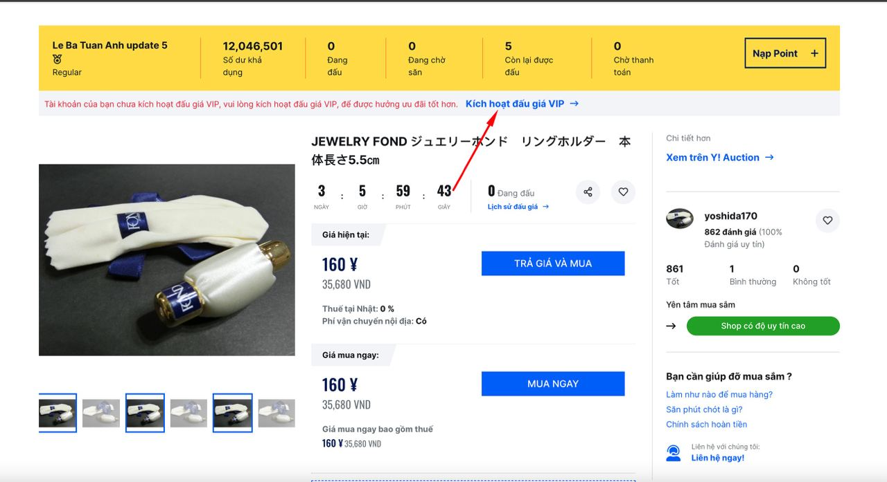

</details>

### Luồng trả giá AUCTION: :heavy_check_mark:

<details>
<summary>Mô tả chi tiết</summary>

* Gọi api [Add Bargain](https://appdev.ezbuy.jp/swagger/index.html#/Bid/post_mobile_api_bid_addbargain) để thực hiện trả
  giá
  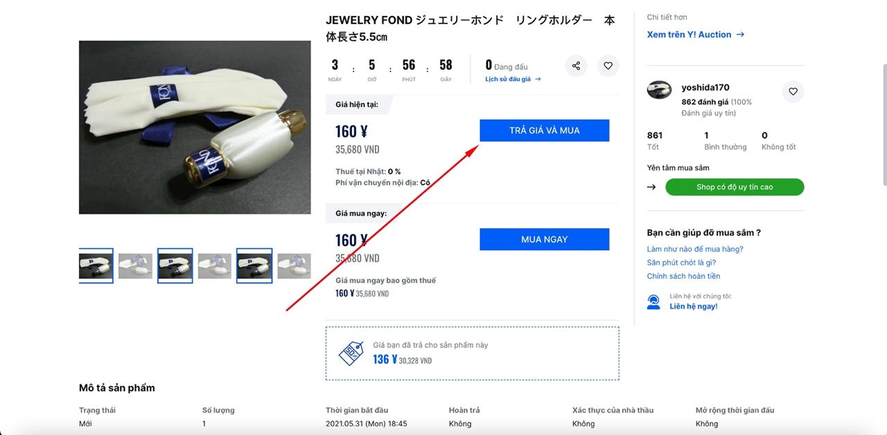
    * Nếu người dùng trả giá thấp hơn (x% * giá sản phẩm) sẽ hiển thị thông báo bằng trường
      *Message và IsSuccess=false*, đồng thời sẽ fill sẵn giá gợi ý cho người dùng vào ô input bằng trường
      *PriceSuggest*.
      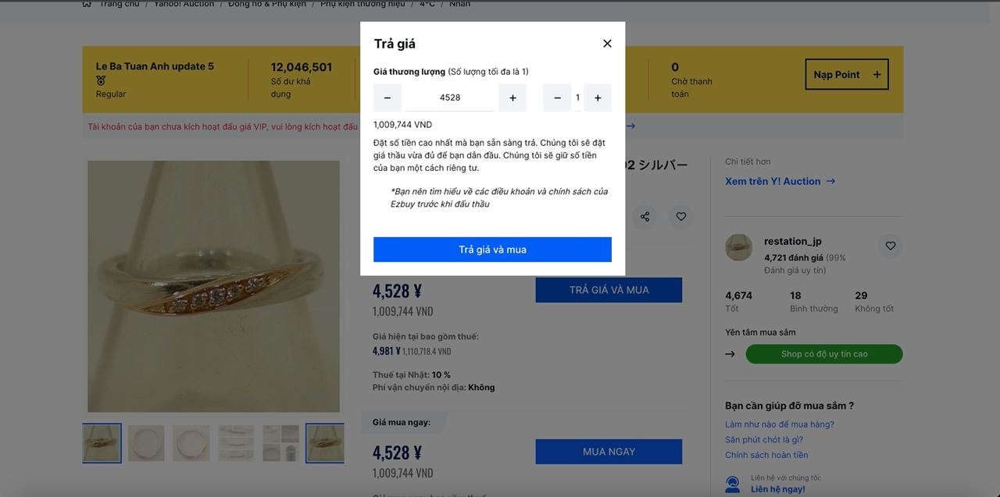
    * Nếu người dùng đã trả giá thì lần sau hiển thị sẽ hiên thị thêm giá đã đặt của người dùng và thực hiện validate
      giá người dùng phải đặt lần tiếp theo lớn hơn giá mà người dùng hiện đang đặt.
      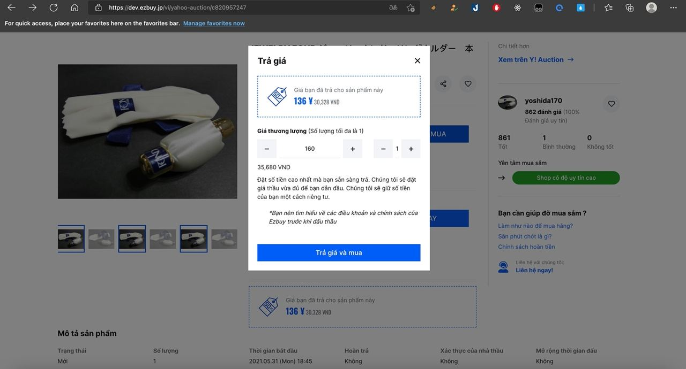

</details>

### Luồng đấu giá AUCTION: :heavy_check_mark:

<details>
<summary>Mô tả chi tiết</summary>

```
if(product.BidOrBuy==1)
{
  Sản phẩm này có nguồn gốc xuất sứ từ Trung Quốc, vì vậy chúng tôi không cho phép đấu giá sản phẩm này!
}
```

* Kiểm tra các điều kiện số tiền đặt giá hiện tại cao hơn số tiền ở trong ví thì không cho người dùng đâu giá và nhắc
  nhở người dùng nạp tiền

  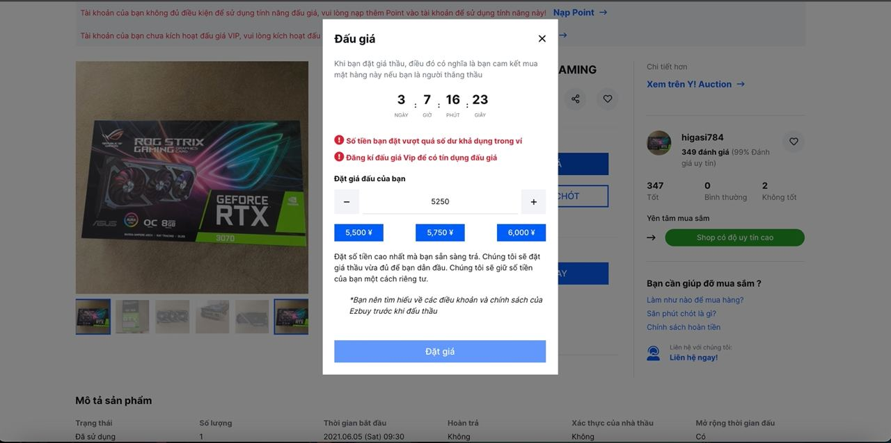

* Bắt buộc người dùng đồng ý vào điều khoản
  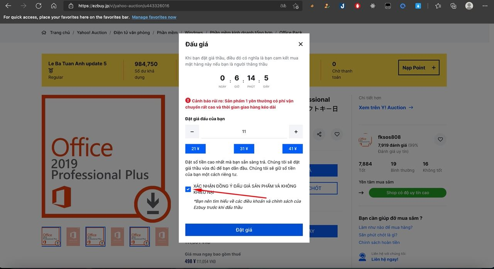

* Gọi api [Bid](https://appdev.ezbuy.jp/swagger/index.html#/Bid/post_mobile_api_bid_bid) để tiền hành đấu giá
    * *Status=true*: Đấu giá đã thành công sau đó hiển thị cho người dùng thông báo và gọi lại gọi
      api [Get My Highest Price](https://localhost:5001/swagger/index.html#/Bid/get_mobile_api_bid_getmyhighestprice)
      để kiểm tra người dùng có phải là người trả giá cao nhất hay không và hiển thị lại dữ liệu.
    * *Status=false*: Đấu giá không thành công nếu có suggestPrice thì hiển thị thông báo đấu giá không thành công kèm
      gợi ý giá cho người dùng ở bước đấu giá tiếp theo đồng thời fill gợi ý giá và ô đặt giá thầu
    * Trường hợp trả về 500 thông báo cho người dùng đấu giá không thành công

</details>

</details>


